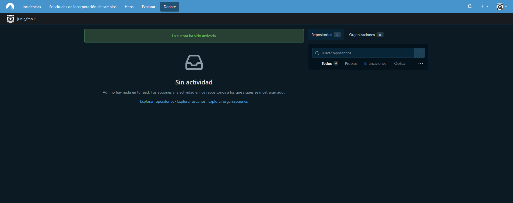

# Comunidades git
<!-- 1. Listado de comunidades que relalizan control de versiones (git u otra) -->
Conforme a las comunidades que realizan control de versiones podemos encontrar:

* GitLab: Es una alteernativa a Github con un enfoque fuerte en automatización. A la vez que nos incluye respositorios Git, tiene un despliegue continuo, control de tareas y gestión de equipos. Puede usarse en su versión en la nube o instalarse en servidores propios.

* Bitbucket: Bitbuchet, de Atlassian, se integra con herramientas como Jira, Confluence y Trello. Esta comenzó soportando GIt y Mercurial, hoy en día se centra en Git. Es muy usado por empresas que hya trabajan con el ecosistema de Atlassian.

* SourceForge: SourceForge fue una de las primeras comunidades grandes de software libre. Aunque perdió protagonismo con la llegada de GitHub, sigue activa, ofreciendo alojamiento para proyectos en Git y Subversion. Muchos proyectos antiguos de código abierto siguen allí.

* Codeberg: Codeberg es una plataforma comunitaria y sin ánimo de lucro, basada en Gitea, que busca ser una alternativa ética y privada a GitHub. Está orientada al software libre, la transparencia y la independencia de grandes corporaciones.

* Gitea: Gitea es un servicio ligero de alojamiento de repositorios Git, similar a GitHub pero autoalojable. Es muy usado por equipos pequeños o proyectos que buscan independencia y simplicidad. Varias comunidades públicas también ofrecen instancias gratuitas de Gitea.

* Heptapod: Es una plataforma que combina GitLab con soporte para Mercurial (hg). Está enfocada en mantener la compatibilidad con proyectos que aún usan Mercurial, ofreciendo una experiencia moderna similar a la de GitLab.

* Assembla: Plataforma enfocada en Subversion (SVN) y también en Git, orientada a equipos profesionales. Se utiliza sobre todo en empresas que requieren repositorios privados y gestión avanzada de proyectos, ofreciendo un ecosistema más cerrado que GitHub o GitLab.

---
---

<!-- 2. Nos damos de alta(en las que podamos) y las probamos -->

1. **Codeberg**
Para comenzar a darnos de alta entramos en su página web https://codeberg.org/

Para crear una nueva rama utilizando git seguimos los siguientes pasos: 

git clone https://codeberg.org/junir_fran/Repositorio_prueba.git

cd tu_repositorio

git checkout -b nueva-rama

git push origin nueva-rama

---

2. **Heptapod**
Nos dirigimos a https://heptapod.net/

 
 
 

Para poder crear un proyecto dentro de Heptapod hay que crear una organización en Clever Cloud. Una vez dentro de la organización cuando ya perteneces a un grupo, te aparece una opción para poder crear nuevos proyectos dentro de ese grupo.

Cuando el proyecto esté creado hay que escoger entre hacerlo con Git o Mercurial y escogemos Git.

Ya creado, utilizando git, para crear una nueva rama, realiamos los mismos pasos realizados anteriormente:

git clone https://foss.heptapod.net/tu_usuario/tu_repo.git

cd tu_repo

git checkout -b nueva-rama

git push origin nueva-rama

---

3. **Assembla**
Entramos en: https://get.assembla.com/

 
 
 
 

 

Una vez esté Git añadido descargamos la URL de acceso al repositorio y ya podemos crear las ramas y duplicarlo sin problema.

--- 
---

### Conclusión
Git domina el ecosistema: casi todas las plataformas lo soportan, y la mayoría de proyectos open source se encuentran en GitHub o GitLab.

Existen alternativas comunitarias como Codeberg o Gitea para quienes buscan más privacidad o independencia.

Las herramientas antiguas como SVN y Mercurial todavía existen, pero han perdido mucho terreno frente a Git.

Para aprender y colaborar, lo más recomendable es registrarse en GitHub, GitLab y Bitbucket.